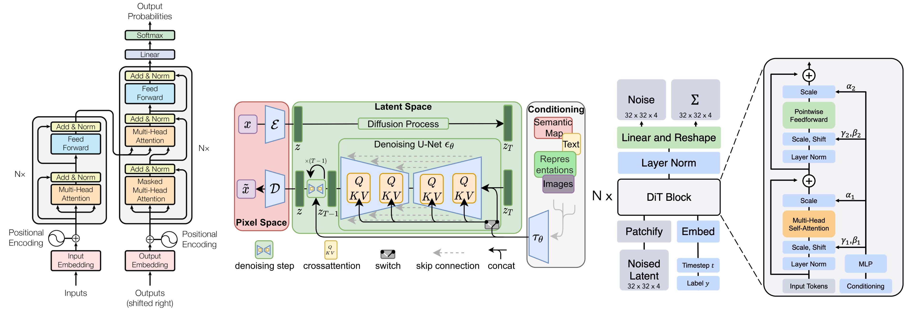

> **[IMPORTANT UPDATE] Assignment Schedule:** [[Google Sheet]](https://docs.google.com/spreadsheets/d/17DBRr8kjZIyAQJ1P26436a4KRUBQLg1sgonxTVYW_DM/edit?usp=sharing)

This course is a research seminar focused on efficient machine learning systems. This is a crucial area as modern deep neural networks, especially Large Language Models (LLMs) and generative models, demand extraordinary levels of computation. This computational cost hinders their deployment and scaling, creating significant challenges for both resource-constrained edge devices and large-scale cloud infrastructure. This course delves into the cutting-edge techniques that enable powerful and efficient AI applications.

We will cover the full stack of AI systems, from low-level kernel optimizations to high-level algorithm and model designs. The course will survey and dissect recent influential research papers in the field.

---
**Topics include:**
- **Kernel-Level Optimizations**: I/O-aware and exact attention mechanisms (e.g., FlashAttention), sparse attention, and custom kernel generation with AI compilers (e.g., TVM, MLIR).

- **Efficient LLMs**: State-of-the-art techniques for efficient training (e.g., ZeRO, LoRA), inference (e.g., vLLM, speculative decoding), model compression (quantization, pruning), and long-context optimizations.

- **Efficient Model Architectures**: Design principles for efficient models, including Mixture-of-Experts (MoE) and State Space Models (Mamba).

- **Generative AI Systems**: Optimization techniques for emerging modalities, including efficient video generation, super-resolution, and understanding.

- **Secure and Private AI**: Methods for ensuring model and data security, including watermarking and encryption in the context of large models.models

This course is run as a research seminar. The focus will be on critically reading, presenting, and discussing influential papers in efficient AI systems. Through weekly readings and student-led presentations, participants will gain a deep understanding of the key challenges, foundational techniques, and future directions in the field. Approximately every two weeks, we will also host a **guest lecture** from a leading researcher or engineer from academia or industry, providing direct insights into the state-of-the-art.

---

**Lecture Videos:** [Link to be provided] 

**Time:** Friday 3:00 PM–4:15 PM CST

**Building:**  Anne and Charles Duncan Hall 

**Room:** 1070

**Start Date:** 08/25/2025 

**End Date:** 12/05/2025

